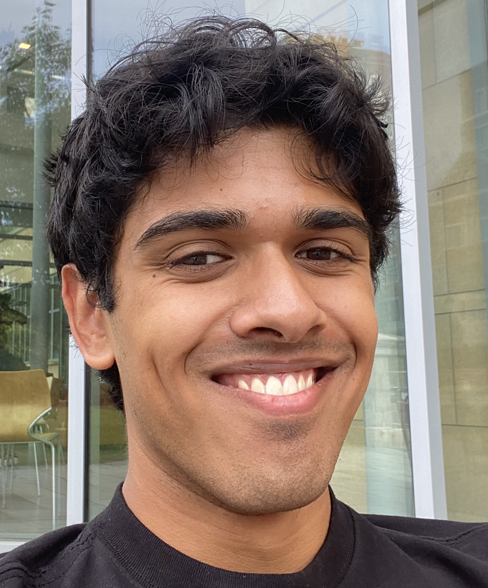

Hello! I'm Eashan Hatti, a computer science undergrad at Yale University. I do research in **formal verification**, with particular emphasis on verification of **concurrent** programs and **quantum** programs.

Email: [eashan.hatti@yale.edu](mailto:eashan.hatti@yale.edu).

### Publications

["A Complete Program Logic for Compositional Linearizability"](https://flint.cs.yale.edu/flint/publications/lhl.pdf) (Distinguished Paper Award, [Artifact](https://github.com/ehatti/LHL))

By <u>Eashan Hatti</u>, Arthur Oliveira Vale, Zhongye Wang, Yueyang Feng, and Zhong Shao.

We present Linearizability Hoare Logic (LHL), the first mechanized, sound and complete program logic for atomic, set, and interval linearizability. We achieve this by showing soundness and completeness of LHL w.r.t. to a more general criterion, compositional linearizability, which subsumes all three criteria. We showcase the range of expressivity of LHL by verifying an exchanger with a set linearizable specification, the eimination-backoff stack built above the exchanger, a lock with an atomic linearized specification, and a write-snapshot object with an interval linearizable specification.

LHL exists within a compositional model for concurrent computation which enables us to use the compositionality features of compositional linearizability to compose verified components together into large systems with a high-level of abstraction for its subcomponents. As a showcase, we verify the elimination-backoff stack implementation modularly by verifying all of its sub-components against their linearized specifications and then linking them together using compositional linearizability.

### Projects

[Lean-QEC](https://github.com/VerifiedQC/Lean-QEC) (**Contributor**)

This project mechanizes the theory of quantum error correction in Lean in an end-to-end fashion, from basic quantum theory to abstract properties. To-date I have contributed:
- Foundational refactorings around the definitions of quantum states and stabilizer codes. These refactorings facilitated algebraic definitions and proofs where these were not possible before.
- The mechanization of the group of logical operators $\mathcal{L} = N(S) / S$ along with the following key theorems.

  $$
  \begin{align*}
  &\text{dim } \mathcal{C} = 2^k \Longleftrightarrow |\mathcal{L}| = 4^k \\
  &\text{dim } \mathcal{C} = 2^k \Longleftrightarrow k = n - r
  \end{align*}
  $$
- The mechanization of the square toric code and a rectangular planar code, along with the proofs that they are $[[2L^2, 2, L]]$ and $[[2L^2, 1, L]]$ codes respectively.
- The mechanization of projective measurement.

